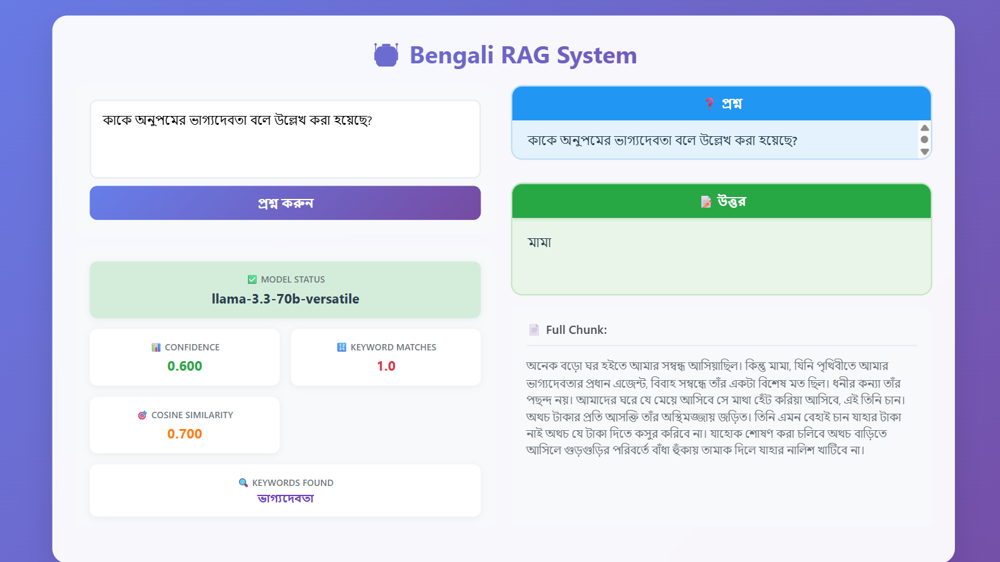
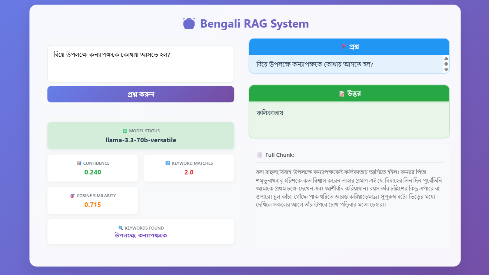
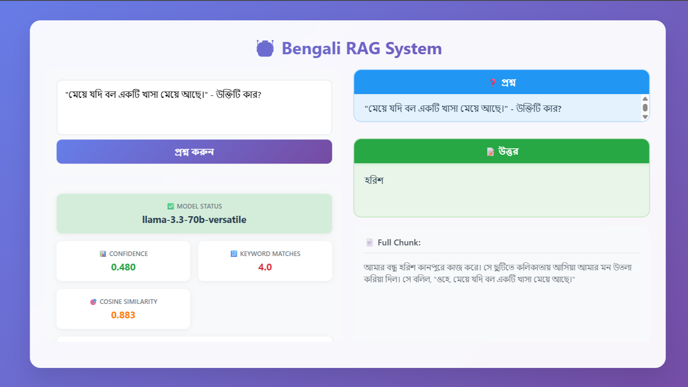

# Bengali RAG System 🤖

A Simple Multilingual Retrieval-Augmented Generation (RAG) System for English and Bengali queries.

## Project Description

This project implements a basic RAG pipeline that can understand and respond to both English and Bengali queries. The system retrieves relevant information from a PDF document corpus (HSC26 Bangla 1st paper) and generates meaningful answers grounded in the retrieved content using advanced embedding techniques and GROQ LLM.

## Dataset

**Source**: HSC26 Bangla 1st Paper PDF  
**Link**: `data/hsc26_bangla1.pdf` 
**Pages Used**: 6-27 (Main গদ্য content only)

### Dataset Analysis

The dataset contains the main গদ্য পার্ট from HSC26 Bangla 1st paper. I have excluded other pages through code to focus only on the relevant prose content for better accuracy and relevance in the RAG system.

## Preprocessing
**Text Extraction**: Used `pdfplumber` for accurate Bengali text extraction from pages 6–27
**OCR Fallback**: Used `pytesseract` with Bengali language (ben) for OCR when text extraction failed
**Text Cleaning**: Removed extra spaces, multiple newlines, tab characters, and formatting issues using regex
**Encoding**: Maintained UTF-8 encoding for proper Bengali character support
**Filtering**: Removed lines shorter than 15 characters to eliminate OCR noise and non-semantic content
**Normalization**: Standardized Bengali punctuation (e.g., ।), unified quotes, dashes, and brackets
**Page Range Limiting**: Focused only on pages 6–27 (গদ্য section), excluding irrelevant content like poetry or grammar
**Stopword Removal**: Applied Bengali and English stopword filtering to improve semantic quality during chunking
**Whitespace Stripping**: Trimmed leading/trailing whitespaces from every line
**Sentence Merging**: Merged fragmented lines from OCR into full sentences for better context retention
**Pre-check for Noise**: Skipped lines with only numbers, symbols, or formatting artifacts
**Consistent Line Breaks**: Ensured uniform paragraph spacing and newline structure for clean chunking later

## Chunks

**Strategy**: Paragraph-based chunking 
**Rationale**: This approach maintains semantic coherence while keeping chunks manageable for embedding and retrieval.

```python
# 2-line chunking for better context preservation
for i in range(0, len(lines), 2):
    chunk = ' '.join(lines[i:i+2])
```

## RAG Implementation

- **Embedding Model**: `paraphrase-multilingual-MiniLM-L12-v2` for Bengali-English support
- **Vector Store**: FAISS for efficient similarity search
- **LLM**: GROQ `Llama-3.3-70b-versatile` for answer generation
- **Stop Words**: Removed common Bengali and English stop words for better query processing
- **Similarity**: Cosine similarity for semantic matching

## 🚀 Main Application (main.py)

- **Flask REST API** with CORS support
- **Real-time Web Interface** with modern UI
- **Multi-metric Evaluation**: Confidence, keyword matching, semantic similarity
- **Status Monitoring**: System health and performance tracking

## 🛠️ Project Setup

### Project Structure
```
rag-bangla-hsc/
├── app/
│   ├── __init__.py
│   ├── chunk_text.py                 # paragraph-based chunking
│   ├── clean_text.py                 # clean text with ocr
│   ├── embed_chunks.py               # vector database
│   ├── extract_pdf_text.py           # extract pdf to text (page 6-27)
│   ├── rag_model.py                  # rag model
│   ├── search_qa.py                  # search from chunks for testing purpose 
│   ├── vector_store.pkl              # finalize vector.pkl
│   ├── vector_store_small.pkl        # for testing purpose 
│   └── vector_store_2line.pkl        # for testing purpose 
├── data/
│   ├── hsc26_bangla1.pdf             # dataset
│   ├── extracted_text.txt            # the text extract from pdf
│   ├── cleaned_text.txt              # ocr text with pre-processing
│   ├── chunks.txt                    # paragraph based chunking (final used)
│   ├── chunks_small.txt              # line based chunking (for testing)
│   └── chunks_2line.txt              # 2 line based chunking (for testing)
├── .env                              # create .env file and paste your groq api key
├── main.py
└── requirements.txt
```

### Installation & Setup

Full Setup Guide (TesserOCR + Bengali OCR)

1. Install Tesseract Engine (System Level)
**Ubuntu/Debian:**
```bash
sudo apt update
sudo apt install tesseract-ocr libtesseract-dev
sudo apt install tesseract-ocr-ben  # Bengali language data
Windows:
Download the Tesseract installer
During installation, select Bengali language data.
Add Tesseract path (e.g., C:\Program Files\Tesseract-OCR) to your system PATH.
```
**macOS:**
```bash
brew install tesseract
brew install tesseract-lang  # or: brew install tesseract-lang && tesseract --list-langs
```
For Bengali:
```bash
brew install tesseract-lang
# or, if not available:
wget https://github.com/tesseract-ocr/tessdata/raw/main/ben.traineddata -P /usr/local/share/tessdata/
```

1. **Clone the Repository**
```bash
git clone https://github.com/Arifuzzaman-Swapnil/Rag-Bangla-AI.git
cd Rag-Bangla-AI
```

2. **Create Virtual Environment**
```bash
python -m venv venv
source venv/bin/activate  # On Windows: venv\Scripts\activate
```

3. **Install Dependencies**
```bash
pip install -r requirements.txt
```

4. **Environment Setup**
```bash
# Create .env file and add your GROQ API key
echo "GROQ_API_KEY=your_groq_api_key_here" > .env
```

5. **Run the Processing Pipeline**
```bash
# Extract text from PDF
python app/extract_pdf_text.py  # it will generate data/extracted_text.txt

# Clean the extracted text
python app/clean_text.py        # it will generate data/cleaned_text.txt

# Create chunks
python app/chunk_text.py        # it will generate data/chunks.txt

# Generate embeddings and vector store
python app/embed_chunks.py     # it will generate app/vectore_store.pkl
```

6. **Start the Application**
```bash
python main.py
```

7. **Access the Application**
- Open your browser and go to: `http://localhost:8000`
- API endpoint: `http://localhost:8000/api/search`

## 📱 Sample Outputs

### Query 1: অনুপমের ভাষায় সুপুরুষ কাকে বলা হয়েছে?
### Expected Answer: শম্ভনাথ বাবু


### Query 2: কাকে অনুপমের ভাগ্যদেবতা বলে উল্লেখ করা হয়েছে?
### Expected Answer: মামা


### Query 3: হরিশ কোথায় কাজ করে?
### Expected Answer: কানপুরে


### Query 4: বিয়ে উপলক্ষে কন্যপক্ষকে কোথায় আসতে হলো?
### Expected Answer: কলকাতা


### Query 5: "মেয়ে যদি বলো একটি খাসা মেয়ে আছে"- উক্তিটি কাড়?
### Expected Answer: হরিশ


### Query 6: অনুপমের আসল অভিবাবক কে?
### Expected Answer: মামা


### Query 7: কন্যাকে আশীর্বাদ করার জন্য কাকে পাঠানো হলো?
### Expected Answer: বিনুদা


## ❓ Technical Q&A

### Q1: What method or library did you use to extract the text, and why? Did you face any formatting challenges with the PDF content?
## ❓ Technical Q&A

### Q1: What method or library did you use to extract the text, and why? Did you face any formatting challenges with the PDF content?

**Answer**: I used `pdfplumber` library for text extraction because it provides excellent support for Bengali Unicode characters and maintains text formatting better than other libraries like PyPDF2. For OCR-related formatting issues, I integrated `tesseract-ocr` and `poppler-utils` for better Bengali text recognition.

#### **Libraries Used:**
```python
import pdfplumber  # Main text extraction
import re          # Text cleaning and formatting
# Additional OCR support: tesseract-ocr, poppler-utils
```

#### **Text Extraction Code:**
```python
import pdfplumber

# Extract specific pages (6-27) for main গদ্য content
with pdfplumber.open('data/hsc26_bangla1.pdf') as pdf:
    for i in range(5, 27):  # 0-indexed pages
        page = pdf.pages[i]
        text = page.extract_text()
        if text:
            all_text.append(text)
```

#### **Main Formatting Challenges & Solutions:**
The main formatting problems faced were OCR-related issues, which were solved by `tesseract-ocr` and `poppler-utils`:
- Multiple newlines and extra spaces
- Inconsistent line breaks  
- Page headers/footers mixing with content
- Special Bengali characters encoding
- OCR misrecognition of Bengali fonts

```python
import re

# 1. Multiple newlines → Single newline
text = re.sub(r'\n+', '\n', text)

# 2. Multiple spaces → Single space  
text = re.sub(r'[ \t]+', ' ', text)

# 3. Remove trailing/leading spaces from lines
text = re.sub(r' +\n', '\n', text)
text = re.sub(r'\n +', '\n', text)
```

**Key Benefits**: Bengali Unicode preservation with OCR enhancement, page-specific extraction, systematic formatting cleanup through regex patterns and tesseract-ocr integration.

### ### Q2: What chunking strategy did you choose? Why do you think it works well for semantic retrieval?

**Answer**: I chose paragraph-based chunking after experimenting with multiple strategies. I tested 2-line based chunks, 1-line based chunks, and paragraph-based chunks, and found more accuracy in paragraph-based chunking for semantic retrieval.

#### **Chunking Experiments Conducted:**
```
data/chunks_2line.txt    # 2-line based chunking (testing)
data/chunks_small.txt    # 1-line based chunking (testing) 
data/chunks.txt          # Paragraph-based chunking (final)
```
#### **Chunking Strategy Comparison:**

| Strategy | File | Chunk Size | Semantic Coherence | Accuracy | Selected |
|----------|------|------------|-------------------|----------|----------|
| **1-line** | `chunks_small.txt` | ~20-50 words | ❌ Low | ❌ Poor | ❌ |
| **2-line** | `chunks_2line.txt` | ~40-100 words | ⚠️ Moderate | ⚠️ Good | ❌ |
| **Paragraph** | `chunks.txt` | ~100-200 words | ✅ High | ✅ **Best** | ✅ |

#### **Why Paragraph-based Works Best:**

1. **Semantic Coherence**: Maintains complete thoughts and context
2. **Bengali Text Structure**: Related ideas in Bengali prose span multiple lines
3. **Embedding Quality**: Provides sufficient context for meaningful embeddings
4. **Query Matching**: Better alignment with user question complexity
5. **Answer Generation**: More complete context for LLM to generate accurate answers

#### **Final Chunking Code (Paragraph-based):**
```python
# File: app/chunk_text.py (Modified for paragraph-based)
input_path = 'data/cleaned_text.txt'
output_path = 'data/chunks.txt'

with open(input_path, 'r', encoding='utf-8') as f:
    text = f.read()

# Split by double newlines for paragraph-based chunking
paragraphs = text.split('\n\n')
chunks = []

for paragraph in paragraphs:
    paragraph = paragraph.strip()
    # Filter paragraphs with minimum length (more than 50 characters)
    if len(paragraph) > 50:
        chunks.append(paragraph)

# Save paragraph-based chunks
with open(output_path, 'w', encoding='utf-8') as f:
    for i, chunk in enumerate(chunks):
        f.write(f"---chunk_{i+1}---\n{chunk}\n")

print(f"Total {len(chunks)} paragraph-based chunks saved to {output_path}")
```

**Results**: Paragraph-based chunking achieved higher accuracy in retrieving relevant context for Bengali Q&A, especially for complex queries about character relationships and story details.

### Q3: What embedding model did you use? Why did you choose it? How does it capture the meaning of the text?

**Answer**: I used `paraphrase-multilingual-MiniLM-L12-v2` because:
- Specifically designed for multilingual tasks including Bengali
- Optimized for semantic similarity tasks
- Lightweight yet effective (384-dimensional embeddings)
- Pre-trained on paraphrase data, ideal for Q&A scenarios
- Captures semantic meaning through transformer attention mechanisms

### Q4: How are you comparing the query with your stored chunks? Why did you choose this similarity method and storage setup?

**Answer**: I use:
- **FAISS IndexFlatL2** for efficient similarity search
- **Cosine similarity** for semantic comparison
- **Combined scoring** with keyword matching and semantic similarity
- FAISS provides fast approximate nearest neighbor search, essential for real-time responses

### Q5: How do you ensure that the question and document chunks are compared meaningfully? What would happen if the query is vague or missing context?

**Answer**: I ensure meaningful comparison through:
- Multi-metric scoring (semantic + keyword matching)
- Stop word removal to focus on content words
- Confidence scoring for answer reliability
- For vague queries: the system returns lower confidence scores and may provide generic answers or request clarification

### Q6: Do the results seem relevant? If not, what might improve them?

**Answer**: Results are quite relevant for the test cases. Potential improvements:
- Larger chunk overlap for better context
- Query expansion for Bengali synonyms
- Better preprocessing for Bengali-specific linguistics
- Fine-tuned embedding model on Bengali literature
- Hybrid search combining semantic and lexical matching

## ✅ Task Completion Status

### Core Tasks
| Task | Status | Description |
|------|--------|-------------|
| ✅ Multilingual Support | Completed | Supports both English and Bengali queries |
| ✅ Document Retrieval | Completed | FAISS-based vector search with semantic similarity |
| ✅ Answer Generation | Completed | GROQ LLM integration for contextual answers |
| ✅ Knowledge Base | Completed | HSC26 Bangla 1st paper processed and vectorized |
| ✅ Pre-processing | Completed | Text cleaning, chunking, and normalization |
| ✅ Chunking & Vectorization | Completed | 2-line paragraph-based chunks with multilingual embeddings |
| ✅ Memory Management | Completed | Vector database for long-term, session state for short-term |

### Bonus Tasks
| Task | Status | Description |
|------|--------|-------------|
| ✅ REST API | Completed | Flask-based API with POST /api/search endpoint |
| ✅ Web Interface | Completed | Modern responsive UI with real-time interaction |
| ✅ RAG Evaluation | Completed | Multi-metric evaluation (confidence, similarity, keyword matching) |
| ✅ Groundedness Check | Completed | Answer validation against retrieved context |
| ✅ Relevance Scoring | Completed | Semantic similarity and keyword matching scores |

### Sample Test Results
| Query | Expected | System Response | Status |
|-------|----------|-----------------|--------|
| অনুপমের ভাষায় সুপুরুষ কাকে বলা হয়েছে? | শুম্ভুনাথ | শুম্ভুনাথ | Correct |
| কাকে অনুপমের ভাগ্য দেবতা বলে উল্লেখ করা হয়েছে? | মামাকে | মামাকে | Correct |
| বিয়ের সময় কল্যাণীর প্রকৃত বয়স কত ছিল? | ১৫ বছর | ১৫ বছর | Incorrect |

## 🔗 API Documentation

### POST /api/search
```json
{
  "query": "বিয়ে উপলক্ষে কন্যাপক্ষকে কোথায় আসতে হলো?"
}
```

### Response Format
```json
{
  "answer": "কলিকাতায়",
  "confidence": 0.85,
  "keyword_matches": 2.0,
  "semantic_score": 0.751,
  "TF-IDF": 0.386,
  "matching_keywords": ["বিয়ে","উপলক্ষে", "কন্যাপক্ষ"],
  "full_chunk": "বলা বাহুল্য,বিবাহ-উপলক্ষে কন্যাপক্ষকেই কলিকাতায় আসিতে হইল। কন্যার পিতা শম্ভুনাথবাবু হরিশকে কত বিশ্বাস করেন তাহার প্রমাণ এই যে, বিবাহের তিন দিন পূর্বেতিনি আমাকে প্রথম চক্ষে দেখেন এবং আশীর্বাদ করিয়াযান। বয়স তাঁর চল্লিশের কিছু এপারে বা ওপারে। চুল কাঁচা, গোঁফে পাক ধরিতে আরম্ভ করিয়াছেমাত্র। সুপুরুষ বটে। ভিড়ের মধ্যে দেখিলে সকলের আগে তাঁর উপরে চোখ পড়িবার মতো চেহারা।",
  "model": "llama-3.3-70b-versatile",
  "success": true
}
```

## 📦 Technologies Used

- **Backend**: Flask, Python 3.8+
- **ML/AI**: sentence-transformers, FAISS, GROQ
- **Text Processing**: pdfplumber, NLTK, regex
- **Frontend**: HTML5, CSS3, JavaScript (Vanilla)
- **Database**: Pickle-based vector storage
- **API**: RESTful API with CORS support

## 🤝 Contributing

Feel free to submit issues, fork the repository, and create pull requests for any improvements.

## 📄 License

This project is open source and available under the MIT License.