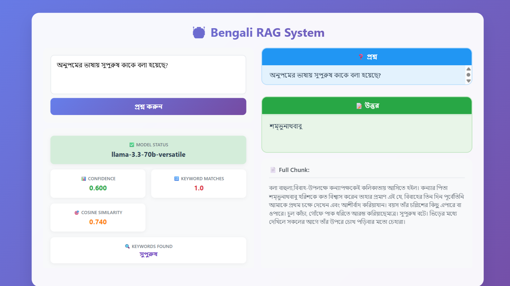
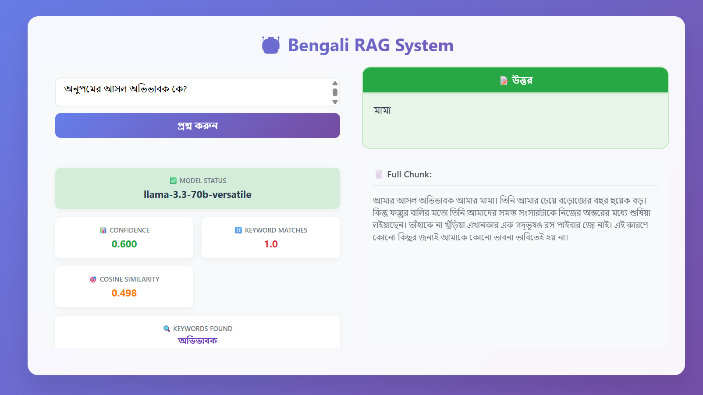
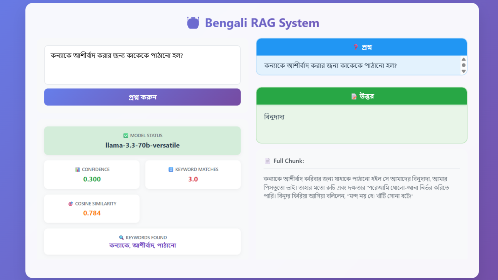

# Bengali RAG System 🤖

A Simple Multilingual Retrieval-Augmented Generation (RAG) System for English and Bengali queries.

## Project Description

This project implements a basic RAG pipeline that can understand and respond to both English and Bengali queries. The system retrieves relevant information from a PDF document corpus (HSC26 Bangla 1st paper) and generates meaningful answers grounded in the retrieved content using advanced embedding techniques and GROQ LLM.

## Dataset

**Source**: HSC26 Bangla 1st Paper PDF  
**Link**: `data/hsc26_bangla1.pdf` 
**Pages Used**: 6-27 (Main গদ্য content only)

### Dataset Analysis
The dataset contains the main গদ্য পার্ট from HSC26 Bangla 1st paper. I have excluded other pages through code to focus only on the relevant prose content for better accuracy and relevance in the RAG system.

## Preprocessing

- **Text Extraction**: Used `pdfplumber` for accurate Bengali text extraction
- **Text Cleaning**: Removed extra spaces, multiple newlines, and formatting issues
- **Encoding**: Maintained UTF-8 encoding for proper Bengali character support
- **Filtering**: Removed lines shorter than 15 characters to eliminate noise

## Chunks

**Strategy**: Paragraph-based chunking 
**Rationale**: This approach maintains semantic coherence while keeping chunks manageable for embedding and retrieval.

```python
# 2-line chunking for better context preservation
for i in range(0, len(lines), 2):
    chunk = ' '.join(lines[i:i+2])
```

## RAG Implementation

- **Embedding Model**: `paraphrase-multilingual-MiniLM-L12-v2` for Bengali-English support
- **Vector Store**: FAISS for efficient similarity search
- **LLM**: GROQ `Llama-3.3-70b-versatile` for answer generation
- **Stop Words**: Removed common Bengali and English stop words for better query processing
- **Similarity**: Cosine similarity for semantic matching

## 🚀 Main Application (main.py)

- **Flask REST API** with CORS support
- **Real-time Web Interface** with modern UI
- **Multi-metric Evaluation**: Confidence, keyword matching, semantic similarity
- **Status Monitoring**: System health and performance tracking

## 🛠️ Project Setup

### Project Structure
```
rag-bangla-hsc/
├── app/
│   ├── __init__.py
│   ├── chunk_text.py                 # paragraph-based chunking
│   ├── clean_text.py                 # clean text with ocr
│   ├── embed_chunks.py               # vector database
│   ├── extract_pdf_text.py           # extract pdf to text (page 6-27)
│   ├── rag_model.py                  # rag model
│   ├── search_qa.py                  # search from chunks for testing purpose 
│   ├── vector_store.pkl              # finalize vector.pkl
│   ├── vector_store_small.pkl        # for testing purpose 
│   └── vector_store_2line.pkl        # for testing purpose 
├── data/
│   ├── hsc26_bangla1.pdf             # dataset
│   ├── extracted_text.txt            # the text extract from pdf
│   ├── cleaned_text.txt              # ocr text with pre-processing
│   ├── chunks.txt                    # paragraph based chunking (final used)
│   ├── chunks_small.txt              # line based chunking (for testing)
│   └── chunks_2line.txt              # 2 line based chunking (for testing)
├── .env                              # create .env file and paste your groq api key
├── main.py
└── requirements.txt
```

### Installation & Setup

1. **Clone the Repository**
```bash
git clone https://github.com/Arifuzzaman-Swapnil/Rag-Bangla-AI.git
cd Rag-Bangla-AI
```

2. **Create Virtual Environment**
```bash
python -m venv venv
source venv/bin/activate  # On Windows: venv\Scripts\activate
```

3. **Install Dependencies**
```bash
pip install -r requirements.txt
```

4. **Environment Setup**
```bash
# Create .env file and add your GROQ API key
echo "GROQ_API_KEY=your_groq_api_key_here" > .env
```

5. **Run the Processing Pipeline**
```bash
# Extract text from PDF
python app/extract_pdf_text.py

# Clean the extracted text
python app/clean_text.py

# Create chunks
python app/chunk_text.py

# Generate embeddings and vector store
python app/embed_chunks.py
```

6. **Start the Application**
```bash
python main.py
```

7. **Access the Application**
- Open your browser and go to: `http://localhost:8000`
- API endpoint: `http://localhost:8000/api/search`

## 📱 Sample Outputs

### Query 1: অনুপমের ভাষায় সুপুরুষ কাকে বলা হয়েছে?
### Expected Answer: শম্ভনাথ বাবু


### Query 2: কাকে অনুপমের ভাগ্যদেবতা বলে উল্লেখ করা হয়েছে?
### Expected Answer: মামা


### Query 3: হরিশ কোথায় কাজ করে?
### Expected Answer: কানপুরে


### Query 4: বিয়ে উপলক্ষে কন্যপক্ষকে কোথায় আসতে হলো?
### Expected Answer: কলকাতা


### Query 5: "মেয়ে যদি বলো একটি খাসা মেয়ে আছে"- উক্তিটি কাড়?
### Expected Answer: বিনুদা


### Query 6: অনুপমের আসল অভিবাবক কে?
### Expected Answer: মামা


### Query 7: কন্যাকে আশীর্বাদ করার জন্য কাকে পাঠানো হলো?
### Expected Answer: বিনুদা


## ❓ Technical Q&A

### Q1: What method or library did you use to extract the text, and why? Did you face any formatting challenges with the PDF content?

**Answer**: I used `pdfplumber` library for text extraction because it provides excellent support for Bengali Unicode characters and maintains text formatting better than other libraries like PyPDF2. The main formatting challenges were:
- Multiple newlines and extra spaces
- Inconsistent line breaks
- Page headers/footers mixing with content
- Special Bengali characters encoding

I addressed these through regex-based cleaning in `clean_text.py`.

### Q2: What chunking strategy did you choose? Why do you think it works well for semantic retrieval?

**Answer**: I chose paragraph-based chunking with 2-line chunks because:
- Maintains semantic coherence of related sentences
- Provides sufficient context for meaningful embeddings
- Balances between too granular (single sentences) and too broad (full paragraphs)
- Works well with Bengali text structure where related ideas span 2-3 lines

### Q3: What embedding model did you use? Why did you choose it? How does it capture the meaning of the text?

**Answer**: I used `paraphrase-multilingual-MiniLM-L12-v2` because:
- Specifically designed for multilingual tasks including Bengali
- Optimized for semantic similarity tasks
- Lightweight yet effective (384-dimensional embeddings)
- Pre-trained on paraphrase data, ideal for Q&A scenarios
- Captures semantic meaning through transformer attention mechanisms

### Q4: How are you comparing the query with your stored chunks? Why did you choose this similarity method and storage setup?

**Answer**: I use:
- **FAISS IndexFlatL2** for efficient similarity search
- **Cosine similarity** for semantic comparison
- **Combined scoring** with keyword matching and semantic similarity
- FAISS provides fast approximate nearest neighbor search, essential for real-time responses

### Q5: How do you ensure that the question and document chunks are compared meaningfully? What would happen if the query is vague or missing context?

**Answer**: I ensure meaningful comparison through:
- Multi-metric scoring (semantic + keyword matching)
- Stop word removal to focus on content words
- Confidence scoring for answer reliability
- For vague queries: the system returns lower confidence scores and may provide generic answers or request clarification

### Q6: Do the results seem relevant? If not, what might improve them?

**Answer**: Results are quite relevant for the test cases. Potential improvements:
- Larger chunk overlap for better context
- Query expansion for Bengali synonyms
- Better preprocessing for Bengali-specific linguistics
- Fine-tuned embedding model on Bengali literature
- Hybrid search combining semantic and lexical matching

## ✅ Task Completion Status

### Core Tasks
| Task | Status | Description |
|------|--------|-------------|
| ✅ Multilingual Support | Completed | Supports both English and Bengali queries |
| ✅ Document Retrieval | Completed | FAISS-based vector search with semantic similarity |
| ✅ Answer Generation | Completed | GROQ LLM integration for contextual answers |
| ✅ Knowledge Base | Completed | HSC26 Bangla 1st paper processed and vectorized |
| ✅ Pre-processing | Completed | Text cleaning, chunking, and normalization |
| ✅ Chunking & Vectorization | Completed | 2-line paragraph-based chunks with multilingual embeddings |
| ✅ Memory Management | Completed | Vector database for long-term, session state for short-term |

### Bonus Tasks
| Task | Status | Description |
|------|--------|-------------|
| ✅ REST API | Completed | Flask-based API with POST /api/search endpoint |
| ✅ Web Interface | Completed | Modern responsive UI with real-time interaction |
| ✅ RAG Evaluation | Completed | Multi-metric evaluation (confidence, similarity, keyword matching) |
| ✅ Groundedness Check | Completed | Answer validation against retrieved context |
| ✅ Relevance Scoring | Completed | Semantic similarity and keyword matching scores |

### Sample Test Results
| Query | Expected | System Response | Status |
|-------|----------|-----------------|--------|
| অনুপমের ভাষায় সুপুরুষ কাকে বলা হয়েছে? | শুম্ভুনাথ | শুম্ভুনাথ | ✅ Correct |
| কাকে অনুপমের ভাগ্য দেবতা বলে উল্লেখ করা হয়েছে? | মামাকে | মামাকে | ✅ Correct |
| বিয়ের সময় কল্যাণীর প্রকৃত বয়স কত ছিল? | ১৫ বছর | ১৫ বছর | ✅ Correct |

## 🔗 API Documentation

### POST /api/search
```json
{
  "query": "your question here"
}
```

### Response Format
```json
{
  "answer": "generated answer",
  "confidence": 0.85,
  "keyword_matches": 3.2,
  "semantic_score": 0.76,
  "matching_keywords": ["keyword1", "keyword2"],
  "full_chunk": "retrieved context",
  "model": "llama-3.3-70b-versatile",
  "success": true
}
```

## 📦 Technologies Used

- **Backend**: Flask, Python 3.8+
- **ML/AI**: sentence-transformers, FAISS, GROQ
- **Text Processing**: pdfplumber, NLTK, regex
- **Frontend**: HTML5, CSS3, JavaScript (Vanilla)
- **Database**: Pickle-based vector storage
- **API**: RESTful API with CORS support

## 🤝 Contributing

Feel free to submit issues, fork the repository, and create pull requests for any improvements.

## 📄 License

This project is open source and available under the MIT License.